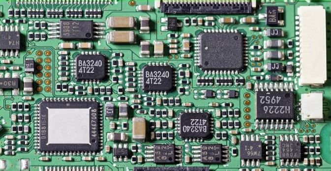
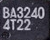
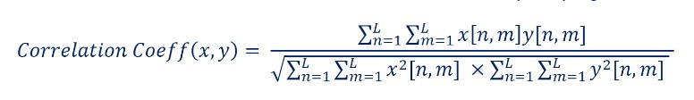
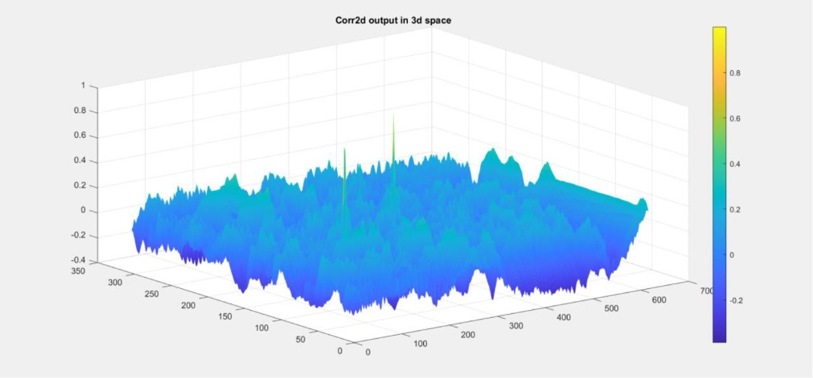
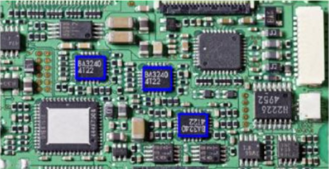

# Image Processing
Finding an Electrical Element(BA3240) on a PCB with **2D Correlation**.

<div style="display: flex;">
  
  
</div>

## Implementation
By converting images to grayscale, the computational complexity is reduced to a 2D dimension.

```ruby
function B = rgb_to_gray(A)
    red = A(:,:,1);
    green = A(:,:,2);
    blue = A(:,:,3);
    
    B = 0.299 * red + 0.578 * green + 0.114 * blue;
end
```
To locate the IC on the PCB, a 2D correlation is employed, with its formula described below.


Additionally, the following code implements the aforementioned process.
```ruby
function corr = corr_2d(x,y)
    sum_xy = sum(sum(x .* y));
    sum_x2 = sum(sum(x .* x));
    sum_y2 = sum(sum(y .* y));
    
    corr = sum_xy / sqrt(sum_x2 * sum_y2);
end
```
The provided code shifts the grayscale image of the IC from the top-left corner of the PCB and performs a comparison between the two images in each correlation section.
```ruby
function M = corr_matrix(PCB,IC)
    [PCB_row,PCB_col] = size(PCB);
    [IC_row,IC_col] = size(IC);
    IC = double(IC);
    IC = IC - mean(IC,'all');
    M = zeros(PCB_row - IC_row + 1, PCB_col - IC_col + 1);
    for i=1:(PCB_row - IC_row + 1)
        for j=1:(PCB_col - IC_col + 1)
            PCB_cropped = double(PCB(i:i + IC_row - 1, j:j + IC_col - 1));
            PCB_cropped = PCB_cropped - mean(PCB_cropped,'all');
            M(i,j) = corr_2d(PCB_cropped,IC);
        end
    end
end

```
and the correlation diagram is shown below:



The graph's height indicates the degree of correlation between the two images, with the highest peaks observed at two locations that contain the IC. Based on the provided diagram, a **threshold** value of 0.75 has been set.

The entire process has also involved utilizing the rotated IC image to identify the rotated ICs on the PCB.

Finally, the matching result is displayed below:



## Course Description
- **Course**: Signals and Systems [ECE 538]
- **Semester**: Spring 2022
- **Institution:** [School of Electrical & Computer Engineering](https://ece.ut.ac.ir/en/), [College of Engineering](https://eng.ut.ac.ir/en), [University of Tehran](https://ut.ac.ir/en)
- **Instructors:** Dr. Akhavan
- **Contributors:** [Fardin Abbasi](https://github.com/fardinabbasi), Iman Rasouli-Parto, Parsa Sattari